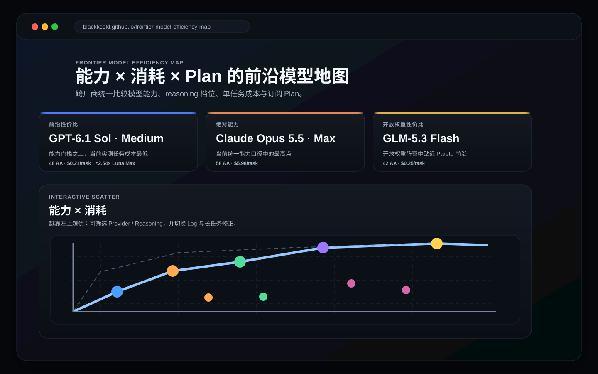
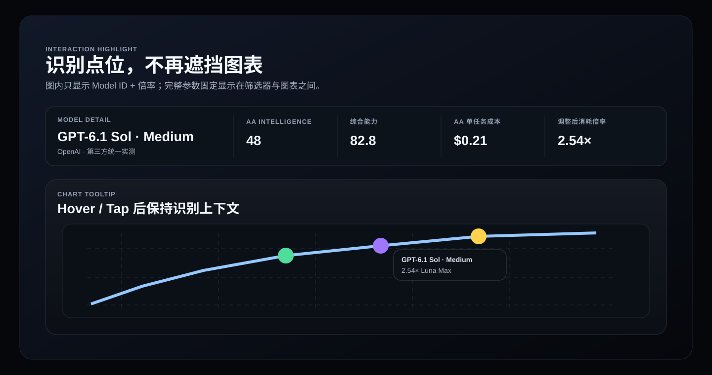

<p align="center">
  
</p>

<h1 align="center">Frontier Model Efficiency Map</h1>

<p align="center">
  把 <strong>模型能力 × Reasoning 档位 × 单任务消耗 × 订阅 Plan</strong> 放到同一张交互地图里。
</p>

<p align="center">
  <a href="https://blackkcold.github.io/frontier-model-efficiency-map/"><strong>Open Live Map ↗</strong></a>
  ·
  <a href="#怎么读这张图">How to read</a>
  ·
  <a href="#方法论">Methodology</a>
  ·
  <a href="LICENSE">MIT</a>
</p>

<p align="center">
  Data snapshot: <strong>2026-10-08</strong> · 6 providers · AA v4.3.2 · No tracking
</p>

---

## 先看体验

<p align="center">
  <a href="https://blackkcold.github.io/frontier-model-efficiency-map/">
    
  </a>
</p>

这不是一个“模型排行榜”，而是一张**决策地图**：

- 顶部三张卡片直接给出当前的 **前沿性价比 / 绝对能力 / 开放权重性价比**。
- 主图把能力放在纵轴、任务消耗放在横轴，**越靠左上越优**。
- Provider、Reasoning 档位、Log 横轴、估算点、历史模型都可以即时筛选。
- 排名表、Plan 推荐与方法论继续向下展开，不需要在多个 benchmark 页面之间来回切换。

> 当前前沿性价比推荐：**GPT-6.1 Sol · Medium**。  
> 当前绝对能力最高点：**Claude Opus 5.5 · Max**。

## 交互细节

<p align="center">
  
</p>

图表交互刻意做得更克制：

- **Hover / 点击 / 触摸模型点**：图内只保留 `Model ID + 消耗倍率`，避免 tooltip 挡住附近点。
- **完整详情固定显示**在筛选器与图表之间，包括 AA Intelligence、归一化能力、AA 单任务成本、修正后倍率、实测 / 估算状态。
- 点击后信息保持，手机端也不依赖 hover；如果筛选条件把当前模型隐藏，详情会自动清空。

## 当前覆盖

| Provider | 当前模型族 |
| --- | --- |
| OpenAI | GPT-6 Luna · GPT-6.1 Sol · GPT-6 Astra · GPT-6 Sol（历史） |
| Anthropic | Claude Haiku 5.5 · Claude Sonnet 5.5 · Claude Opus 5.5 · Claude Fable 5.1 |
| Google | Gemini 3.8 Flash · Gemini 4 Argon |
| DeepSeek | DeepSeek V4.1 Flash |
| Z.ai | GLM-5.3 · GLM-5.3 Flash |
| Kimi | Kimi K3 |

### 当前快照的三个锚点

| 目标 | 推荐 | AA Index | AA task cost | 备注 |
| --- | --- | ---: | ---: | --- |
| 前沿性价比 | **GPT-6.1 Sol · Medium** | 48 | $0.21 | 能力门槛之上的最低实测任务成本 |
| 绝对能力 | **Claude Opus 5.5 · Max** | 58 | $5.98 | 当前页面统一能力口径最高点 |
| 开放权重性价比 | **GLM-5.3 Flash** | 42 | $0.25 | 开放权重阵营中靠近 Pareto 前沿 |

## 怎么读这张图

### 1. 纵轴：能力

默认使用 **Artificial Analysis Intelligence Index v4.3.2**，并把当前最高点线性归一为 100：

```text
normalized capability = AA Intelligence Index / 58 × 100
```

这样不同 Provider 不需要混用各自的厂商 benchmark。

### 2. 横轴：单任务消耗

默认使用 Artificial Analysis 的 **Cost per Intelligence Index Task**，再以 GPT-6 Luna Max 作为 1× 基准：

```text
consumption ratio = corrected task cost / corrected GPT-6 Luna Max task cost
```

跨厂商的 ChatGPT allowance、Claude session cap、Kimi credits 等内部额度并不等价，所以主图不直接把订阅额度强行换算到同一条轴上。

### 3. 长 Agent 修正

AA 的 task cost 已包含 reasoning token；页面额外提供一个**可关闭的长任务修正层**，用于近似持续 Agent loop 的订阅额度体感：

| Effort | 修正 |
| --- | ---: |
| Low | 1.00× |
| Medium | 1.00× |
| High | 1.05× |
| XHigh | 1.10× |
| Max | 1.18× |

它不是厂商官方计费倍率。

## 数据可信度

页面把三类信息明确区分：

**官方信息**  
用于确认模型是否存在、Reasoning / Effort 档位、订阅 Plan、价格、额度和产品政策。

**统一第三方实测**  
Artificial Analysis 用于跨厂商能力与单任务成本的统一比较。

**显式估算**  
只有在“官方确认该档位存在、但当前 AA 没有对应统一测量”时才补点；UI 使用叉形空心点，并允许一键隐藏。

当前估算点包括 Gemini 3.8 Flash Low、DeepSeek V4.1 Flash Low / High、GLM-5.3 High、Kimi K3 High。

## 方法论

“前沿性价比”不是简单做 **能力 ÷ 价格**。极便宜但能力明显偏低的模型会在这种公式里被数学性放大，因此本项目采用：

1. 先设能力门槛：当前为 **AA Index ≥ 48**；
2. 再在满足门槛的实测点中寻找最低任务成本；
3. 估算点不参与“最高能力”结论；
4. Plan 推荐与 API task cost 分开处理。

这让推荐更接近“这个模型能不能完成目标任务，以及完成它要消耗多少资源”。

## 2026-10 快照变化

- **Claude Haiku 5.5（10/7）**：新增 Low / Medium / High / XHigh / Max 五个 AA 实测点；AA Index 29 → 43，AA task cost $0.02 → $0.21。官方定价（≤100K prompt）为 $0.10/M input、$0.50/M output、$0.01/M cache read。
- **Claude Sonnet 5.5（10/7）**：Anthropic 将 cache read 从 $0.20/M 下调到 $0.10/M；按当前 AA 统一口径刷新后，Low / Medium / High / XHigh / Max task cost 约为 $0.35 / $0.48 / $0.88 / $2.01 / $5.46。
- **Claude Max / Team（10/7）**：Max 5x / 20x 新增 $100 / $200 每月 Claude Platform API credit；Team 按席位发放并共享池化，最高 $500/月。该 credit 不能用于 Claude 或 Claude Code 的额外交互用量。
- **GPT-6 in ChatGPT（10/7）**：Plus / Pro / Business / Enterprise 的 Chat 默认进入 GPT-6 Sol；Pro 的 Pro reasoning 继续使用 GPT-6 Astra。Work / Codex 模型未因这次 Chat 发布而替换。
- **OpenAI Pro policy**：Pro 200 已重新开放新订阅；官方同时注明非 grandfathered 的新 Pro 订阅内含用量低于旧档。Pro 500 仍是唯一包含 Astra Ultrafast 的自助 Pro 档。
- **Claude Fable 5.1**：继续保留当前实测前沿点。
- **Gemini 4 Argon**：继续以 limited rollout / preview 状态纳入，不视为全面可用。
- **GPT-6 Sol**：保留历史对比，但默认隐藏，由 GPT-6.1 Sol 取代当前位置。

**推荐结论未变化**：前沿性价比仍为 **GPT-6.1 Sol · Medium**；绝对能力仍为 **Claude Opus 5.5 · Max**。Plan 分类不改，但 Claude Max 5x / 20x 因新增 API credit 的实际价值提高。

更完整的来源链接在网页的 **Methodology & Sources** 区域以及 `data.js` 中。

## 本地运行

这是纯静态站点，不需要构建步骤：

```bash
python3 -m http.server 8000
```

然后打开 `http://localhost:8000`。

## Project

- Live site: https://blackkcold.github.io/frontier-model-efficiency-map/
- License: [MIT](LICENSE)
- Contribution: [CONTRIBUTING.md](CONTRIBUTING.md)
- Security: [SECURITY.md](SECURITY.md)
- Validation: `Static validation`
- Deployment: GitHub Pages
- Governance: CODEOWNERS + protected `main`

---

<p align="center">
  <sub>Static site · No analytics · No tracking · Built for GitHub Pages</sub>
</p>
